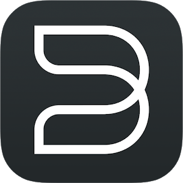

# ioBroker.bluesound

**Tests:** 

## bluesound adapter for ioBroker

Adapter to control Bluesound devices

## Functions included

The adapter uses API calls in the format: http://--playerAPI--:11000/xxx

At startup the presets are read and added to the 'presets' channel.
Player model and name are stored in the 'info' channel.
When player is playing the titles are set in the 'info' channel.
The player status is polled in the interval set by '.config.pollingtime' and the result is stored in '.control.state' as well as in '.info.\*'.

The following functions are implemented:

Player stop (triggered by setting '.control.stop' to true)
Player start (triggered by setting '.control.start' to true)
Player Pause (triggered by setting '.control.pause' to true, toggle mode)
Play Presetxxx (triggered by setting '.presets.preset(x).start' to true)
Change Volume (triggered by changing '.control.volume')

## Changelog

### **Work in Progress**

    (Uwe Nagel) Added config descriptions
    (Uwe Nagel) Added translations for object descriptions
    (Uwe Nagel) Added role definition for all objects
    (Uwe Nagel) Added Timeout config Parameter

### 1.0.0 (2024-05-17)

-   (Uwe Nagel) initial release

## License

MIT License

Copyright (c) 2024 Uwe Nagel <uwenagel@kabelmail.de>

Permission is hereby granted, free of charge, to any person obtaining a copy
of this software and associated documentation files (the "Software"), to deal
in the Software without restriction, including without limitation the rights
to use, copy, modify, merge, publish, distribute, sublicense, and/or sell
copies of the Software, and to permit persons to whom the Software is
furnished to do so, subject to the following conditions:

The above copyright notice and this permission notice shall be included in all
copies or substantial portions of the Software.

THE SOFTWARE IS PROVIDED "AS IS", WITHOUT WARRANTY OF ANY KIND, EXPRESS OR
IMPLIED, INCLUDING BUT NOT LIMITED TO THE WARRANTIES OF MERCHANTABILITY,
FITNESS FOR A PARTICULAR PURPOSE AND NONINFRINGEMENT. IN NO EVENT SHALL THE
AUTHORS OR COPYRIGHT HOLDERS BE LIABLE FOR ANY CLAIM, DAMAGES OR OTHER
LIABILITY, WHETHER IN AN ACTION OF CONTRACT, TORT OR OTHERWISE, ARISING FROM,
OUT OF OR IN CONNECTION WITH THE SOFTWARE OR THE USE OR OTHER DEALINGS IN THE
SOFTWARE.
